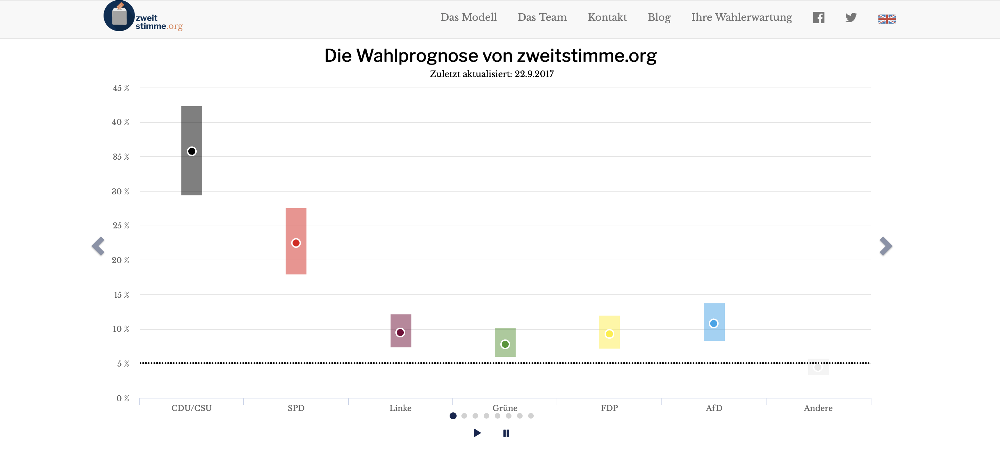

```{r setup, include=FALSE}
options(htmltools.dir.version = FALSE)
knitr::opts_chunk$set(
  fig.width=9, fig.height=3.5, fig.retina=3,
  out.width = "100%",
  cache = FALSE,
  echo = TRUE,
  message = FALSE, 
  warning = FALSE,
  hiline = TRUE
)
library(xaringanthemer)

# library(showtext)
# ## Loading Google fonts (https://fonts.google.com/)
# font_add_google("Lato", "lato")
# font_add_google("Lora", "lora")
# 
# ## Automatically use showtext to render text
# showtext_auto()

```

```{r metathis, echo=FALSE}
library(metathis)
meta() %>%
  meta_name("github-repo" = "zweitstimme-org/zweitstimme_hertie") %>% 
  meta_social(
    title = "zweitstimme.org",
    description = paste(
      "Zweitstimme.org the scientific forecast for the german general election 2021.",
      "Presented at Hertie School 23 September 2021."
    ),
    url = "zweitstimme.org",
    og_type = "website",
    og_author = "Marcel Neunhoeffer",
    twitter_card_type = "summary_large_image",
    twitter_creator = "@zweitstimme_org",
    twitter_site = "@zweitstimme_org"
  )
```

```{r xaringanExtra-share-again, echo=FALSE}
xaringanExtra::use_share_again()
```


<style type="text/css">
.remark-slide-content {
    font-size: 30px;
}

.table {
  font-size: 8px;
}


</style>

## We started zweitstimme.org in 2016 to communicate uncertainty associated with election polling.

<p align="center">

</p>
---

## We started zweitstimme.org in 2016 to communicate uncertainty associated with election polling.

<p align="center">

</p>
---

## We started zweitstimme.org in 2016 to communicate uncertainty associated with election polling.

<p align="center">

</p>
---

## Three things we can say for the election on Sunday.

+ ### The race is still open.
+ ### The political district map is likely to be very colorful.
+ ### The Bundestag will likely be the biggest ever.

---

## Our forecast for Sunday shows that the race is still open.

<p align="center"><iframe frameBorder=0 sandbox='allow-scripts allow-same-origin allow-presentation' allowfullscreen='true'  height='460' src='https://datawrapper.dwcdn.net/55hfT/1391/'  width='100%'></iframe></p>

---
## The map of district winners is likely to be the most colorful since 1953.

<p align="center"><iframe frameBorder=0 sandbox='allow-scripts allow-same-origin allow-presentation' allowfullscreen='true'  height='460' src='https://api.zweitstimme.org/map'  width='100%'></iframe></p>


---
## We are very certain that the next Bundestag will be the biggest Bundestag ever.

<p align="center"><iframe frameBorder=0 sandbox='allow-scripts allow-same-origin allow-presentation' allowfullscreen='true'  height='460' src='https://datawrapper.dwcdn.net/SK6kX/19/'  width='100%'></iframe></p>

---
## We expect that several coalitions will have seat majorities in the next Bundestag.

<p align="center"><iframe frameBorder=0 sandbox='allow-scripts allow-same-origin allow-presentation' allowfullscreen='true'  height='460' src='https://datawrapper.dwcdn.net/qIOJA/1402/'  width='100%'></iframe></p>

---

## We can assign probabilities of getting elected for all 6,211 candidates.

<p align="center"><iframe frameBorder=0 sandbox='allow-scripts allow-same-origin allow-presentation' allowfullscreen='true'  height='460' src='https://api.zweitstimme.org/cand_prob'  width='100%'></iframe></p>


---

class: my-one-page-font

## zweitstimme.org is a team effort.

<style>
table.fixed {
      table-layout: fixed;
      width: 100%;
      border: none;
      font-size: 70%;
    }
table.fixed td {
      overflow: hidden;
    }
    
</style>


<table class="fixed">
	<col width=33% />
     <col width=33% />
     <col width=33% />
  <tr>
    <td> <p align="center"><br> Thomas Gschwend <br>University of Mannheim</p> </td>
    <td> <p align="center"><br> Klara Müller <br>University of Mannheim</p> </td>
    <td> <p align="center"><br> Simon Munzert <br>Hertie School</p> </td>
   </tr> 
</table>

<table class="fixed">
	<col width=50% />
     <col width=50% />
  <tr>
    <td> <p align="center"><br> Marcel Neunhoeffer <br>LMU Munich</p> </td>
    <td> <p align="center"><br> Lukas F. Stoetzer <br>HU Berlin</p> </td>

   </tr> 
</table>

---

class: center, middle

## You can find our forecast and more details about our models on our homepage.

<a href="https://zweitstimme.org">zweitstimme.org</a>
``

---

class: center, middle


Slides created via the R packages:

[**xaringan**](https://github.com/yihui/xaringan)<br>
[gadenbuie/xaringanthemer](https://github.com/gadenbuie/xaringanthemer)

The chakra comes from [remark.js](https://remarkjs.com), [**knitr**](http://yihui.name/knitr), and [R Markdown](https://rmarkdown.rstudio.com).
